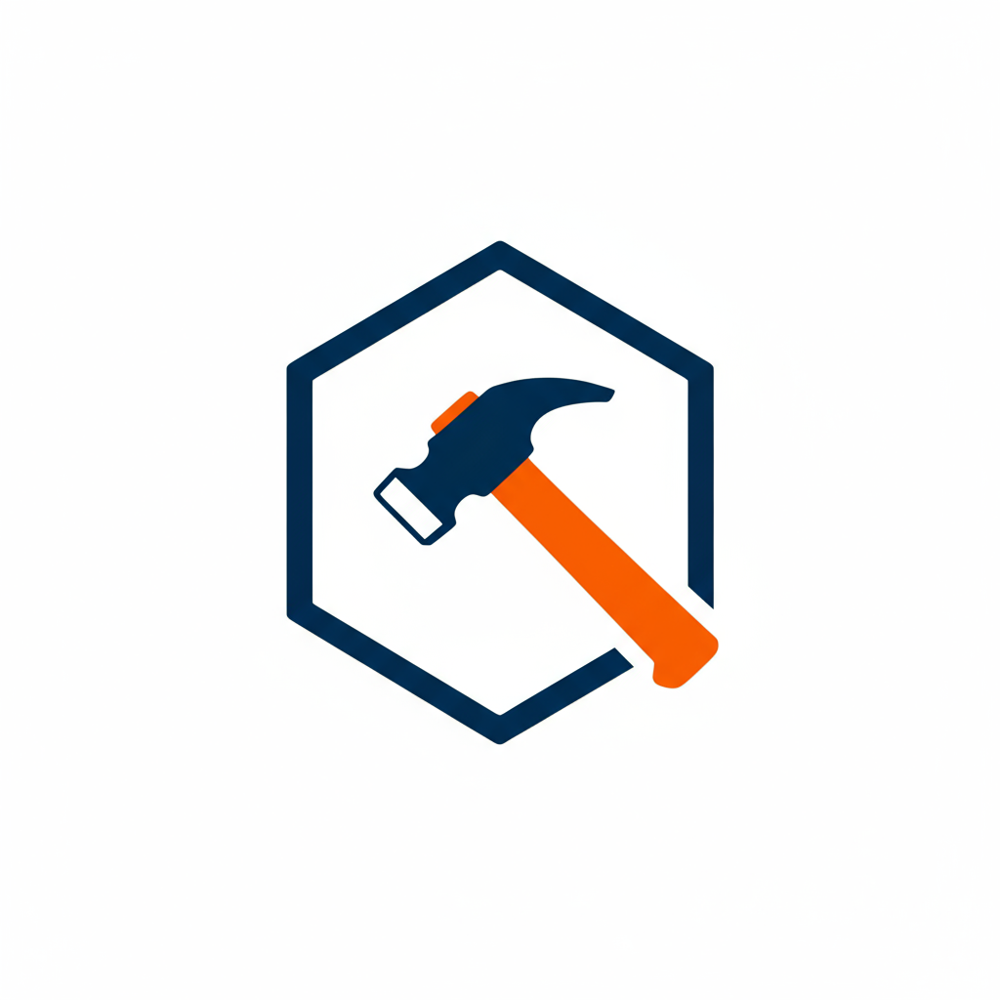

<div style="text-align:center">
 
</div>

<div align="center">

**轻量级、类型安全的前端领域驱动设计(DDD)框架**

帮助您在前端应用中优雅地实践 DDD 模式

<!-- 等待 NPM 包发布后启用
[](https://www.npmjs.com/package/@your-scope/forge)
[](https://www.npmjs.com/package/@your-scope/forge)
[](https://bundlephobia.com/package/@your-scope/forge)
-->

[](./LICENSE)
[](https://www.typescriptlang.org/)
[](https://github.com/prettier/prettier)

<!-- 创建 GitHub 仓库后取消注释 -->
<!--
[](https://github.com/crg-ai/forge/actions/workflows/ci.yml)
[](https://codecov.io/gh/crg-ai/forge)
[](https://github.com/crg-ai/forge/stargazers)
[](https://github.com/crg-ai/forge/issues)
[](https://github.com/crg-ai/forge/pulls)
[](https://github.com/crg-ai/forge/graphs/contributors)
-->

[特性](#-特性) • [快速开始](#-快速开始) • [核心概念](#-核心概念) • [示例](#-示例) • [文档](#-文档) • [贡献](#-贡献)

</div>

## ✨ 特性

- 🎯 **核心DDD构建块** - Entity、ValueObject、AggregateRoot、Repository等
- 🔒 **类型安全** - 完整的TypeScript支持，提供强类型保障
- 📦 **轻量级** - 无外部依赖，核心代码精简（< 10KB）
- 🎨 **灵活架构** - 支持分层架构（Domain、Application、Infrastructure、Presentation）
- 🚀 **事件驱动** - 内置领域事件和事件总线支持
- ⚡ **现代化** - ES6+语法，支持Tree-shaking
- 🧪 **测试友好** - 易于测试的设计，100% 测试覆盖率
- 📝 **完善文档** - 详细的API文档和使用示例

## 🚀 快速开始

### 安装

```bash
# 使用 npm
npm install forge

# 使用 yarn
yarn add forge

# 使用 pnpm
pnpm add forge
```

### 基础使用

```typescript
import { Entity, ValueObject, AggregateRoot, Repository } from 'forge'

// 定义值对象
class Email extends ValueObject<{ value: string }> {
  validate(): void {
    if (!this.props.value.includes('@')) {
      throw new Error('Invalid email format')
    }
  }
}

// 定义实体
class User extends Entity<{
  name: string
  email: Email
}> {
  changeName(name: string): void {
    this.props.name = name
    this.addDomainEvent('UserNameChanged', { userId: this.id, newName: name })
  }
}

// 使用Repository管理实体
class UserRepository extends Repository<User> {
  async findByEmail(email: string): Promise<User | null> {
    // 实现查询逻辑
    return null
  }
}
```

## 📚 核心概念

### Entity（实体）

具有唯一标识符的领域对象，生命周期内保持身份不变。

```typescript
class Product extends Entity<{ name: string; price: number }> {
  // 实体业务逻辑
}
```

### ValueObject（值对象）

不可变的、没有身份标识的对象，通过属性值来判断相等性。

```typescript
class Money extends ValueObject<{ amount: number; currency: string }> {
  // 值对象逻辑
}
```

### AggregateRoot（聚合根）

聚合的入口点，确保聚合内的一致性。

```typescript
class Order extends AggregateRoot<{ items: OrderItem[]; total: Money }> {
  // 聚合根逻辑
}
```

### Repository（仓储）

提供对聚合的持久化和检索接口。

```typescript
class OrderRepository extends Repository<Order> {
  // 仓储实现
}
```

## 🎯 示例

查看 [examples](./examples) 目录获取完整示例：

- [电商系统](./examples/e-commerce)
- [博客系统](./examples/blog)
- [任务管理](./examples/todo)

## 📖 文档

<!-- API 文档链接将在 GitHub Pages 配置后启用 -->
<!-- - [API 文档](https://crg-ai.github.io/forge) -->

- [架构指南](./docs/architecture.md)
- [最佳实践](./docs/best-practices.md)
- [迁移指南](./docs/migration.md)

## 🤝 贡献

欢迎贡献！请查看 [贡献指南](CONTRIBUTING.md) 了解详情。

### 开发

```bash
# 克隆项目
git clone https://github.com/crg-ai/forge.git

# 安装依赖
npm install

# 开发模式
npm run dev

# 运行测试
npm test

# 构建项目
npm run build
```

## 📄 许可证

[MIT](LICENSE) © 2025 Forge Contributors

## 🙏 致谢

感谢所有贡献者的努力！

<!-- 创建 GitHub 仓库后启用
<a href="https://github.com/crg-ai/forge/graphs/contributors">
  
</a>
-->

---

<div align="center">

_用 ❤️ 构建，致力于让 DDD 在前端更简单_

</div>
