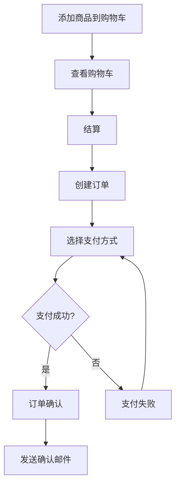

# E-Commerce 电商系统示例

完整的电商系统 DDD 实现，展示复杂业务场景和聚合协作。

## 🎯 功能特性

- ✅ 商品管理（Product Catalog）
- ✅ 购物车（Shopping Cart）
- ✅ 订单处理（Order Processing）
- ✅ 支付流程（Payment Workflow）
- ✅ 库存管理（Inventory Management）
- ✅ 用户账户（User Accounts）

## 📐 领域模型

### 核心聚合

#### 1. Product Aggregate（商品聚合）

```typescript
class Product extends AggregateRoot<ProductProps> {
  // 商品信息
  readonly name: string
  readonly price: Money
  readonly category: Category

  // 业务方法
  updatePrice(newPrice: Money): void
  changeCategory(category: Category): void
  markAsOutOfStock(): void
}
```

#### 2. ShoppingCart Aggregate（购物车聚合）

```typescript
class ShoppingCart extends AggregateRoot<CartProps> {
  private items: CartItem[]

  addItem(product: Product, quantity: number): void
  removeItem(itemId: string): void
  updateQuantity(itemId: string, quantity: number): void
  clear(): void
  calculateTotal(): Money
}
```

#### 3. Order Aggregate（订单聚合）

```typescript
class Order extends AggregateRoot<OrderProps> {
  private items: OrderItem[]
  private status: OrderStatus

  static createFromCart(cart: ShoppingCart): Result<Order>
  addItem(product: Product, quantity: number): void
  confirm(): void
  cancel(): void
  completePayment(payment: Payment): void
}
```

### 领域事件

```typescript
// 订单事件
class OrderCreated extends DomainEvent {}
class OrderConfirmed extends DomainEvent {}
class OrderCancelled extends DomainEvent {}
class OrderPaid extends DomainEvent {}

// 支付事件
class PaymentProcessed extends DomainEvent {}
class PaymentFailed extends DomainEvent {}

// 库存事件
class InventoryReserved extends DomainEvent {}
class InventoryReleased extends DomainEvent {}
```

## 🏗️ 架构设计

### 分层结构

```
e-commerce/
├── domain/
│   ├── product/
│   │   ├── Product.ts
│   │   ├── Category.ts
│   │   └── ProductRepository.ts
│   ├── cart/
│   │   ├── ShoppingCart.ts
│   │   ├── CartItem.ts
│   │   └── CartRepository.ts
│   ├── order/
│   │   ├── Order.ts
│   │   ├── OrderItem.ts
│   │   ├── OrderStatus.ts
│   │   └── OrderRepository.ts
│   ├── payment/
│   │   ├── Payment.ts
│   │   ├── PaymentMethod.ts
│   │   └── PaymentService.ts
│   └── shared/
│       ├── Money.ts
│       ├── Address.ts
│       └── Email.ts
├── application/
│   ├── use-cases/
│   │   ├── AddToCart.ts
│   │   ├── PlaceOrder.ts
│   │   ├── ProcessPayment.ts
│   │   └── CancelOrder.ts
│   └── services/
│       ├── OrderService.ts
│       └── InventoryService.ts
├── infrastructure/
│   ├── repositories/
│   │   ├── InMemoryProductRepository.ts
│   │   ├── InMemoryCartRepository.ts
│   │   └── InMemoryOrderRepository.ts
│   ├── payment/
│   │   └── StripePaymentGateway.ts
│   └── events/
│       └── InMemoryEventBus.ts
└── presentation/
    ├── components/
    │   ├── ProductList.tsx
    │   ├── ShoppingCart.tsx
    │   └── Checkout.tsx
    └── pages/
        ├── HomePage.tsx
        ├── ProductPage.tsx
        └── CheckoutPage.tsx
```

## 💡 核心业务规则

### 购物车规则

1. 每个商品只能添加一次，重复添加会更新数量
2. 商品数量必须大于 0
3. 购物车总价不能超过系统限制
4. 商品必须有库存才能添加

### 订单规则

1. 订单必须至少包含一个商品
2. 只有 Pending 状态的订单可以修改
3. 已确认的订单不能取消（除非特殊权限）
4. 订单总价必须与商品价格一致
5. 支付成功后订单状态变为 Paid

### 支付规则

1. 支付金额必须与订单总价一致
2. 同一订单不能重复支付
3. 支付失败后允许重试
4. 超时未支付自动取消订单

## 🔄 业务流程

### 下单流程



## 📝 使用示例

### 添加商品到购物车

```typescript
// Use Case
class AddToCartUseCase {
  async execute(customerId: string, productId: string, quantity: number) {
    const cart = await this.cartRepo.findByCustomerId(customerId);
    const product = await this.productRepo.findById(productId);

    if (!product) {
      return Result.fail('Product not found');
    }

    cart.addItem(product, quantity);

    await this.cartRepo.save(cart);
    await this.eventBus.publishAll(cart.getUncommittedEvents());

    return Result.ok();
  }
}

// 在组件中使用
const AddToCartButton = ({ productId }: Props) => {
  const addToCart = useAddToCart();

  const handleClick = async () => {
    const result = await addToCart(productId, 1);

    if (result.isSuccess) {
      toast.success('已添加到购物车');
    }
  };

  return <button onClick={handleClick}>加入购物车</button>;
};
```

### 下单支付

```typescript
// Use Case
class PlaceOrderUseCase {
  async execute(customerId: string) {
    const cart = await this.cartRepo.findByCustomerId(customerId)

    if (cart.isEmpty()) {
      return Result.fail('Cart is empty')
    }

    // 创建订单
    const orderResult = Order.createFromCart(cart)
    if (orderResult.isFailure) {
      return Result.fail(orderResult.error)
    }

    const order = orderResult.value

    // 保存订单
    await this.orderRepo.save(order)

    // 清空购物车
    cart.clear()
    await this.cartRepo.save(cart)

    // 发布事件
    await this.eventBus.publishAll(order.getUncommittedEvents())

    return Result.ok(order)
  }
}
```

## 🧪 测试

运行测试：

```bash
npm test                 # 运行所有测试
npm run test:unit        # 只运行单元测试
npm run test:integration # 只运行集成测试
npm run test:coverage    # 生成覆盖率报告
```

## 🚀 运行项目

```bash
# 安装依赖
npm install

# 启动开发服务器
npm run dev

# 构建生产版本
npm run build
```

## 📚 学习要点

1. **复杂聚合设计** - Order 聚合包含多个实体和值对象
2. **聚合协作** - 通过领域事件实现聚合间的松耦合
3. **业务规则封装** - 所有业务逻辑都在领域模型中
4. **事务一致性** - 单个聚合内的强一致性
5. **事件驱动** - 使用领域事件解耦系统

## 🔗 相关资源

- [Forge 文档](../../README.md)
- [DDD 模式指南](../../.claude/rules/ddd-patterns.md)
- [更多示例](../README.md)
